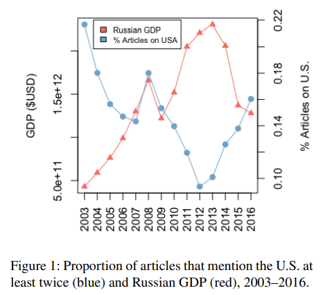

# Framing and Agenda-setting in Russian News: a Computational Analysis of Intricate Political Strategies
# Anjalie Field

### Notes:
- This paper uses a computational approach to analyze the framing and agenda-setting strategies of Russian news media. The authors use a corpus of 100K news articles of 13 yearsfrom the newspaper Izvestia. They find that Russian news media is highly polarized and that the outlets use different framing strategies to cover the inside problems of Russia by pointing out different news in the other countries.

- They also considered the effect of the news coverage of foreign events (mainly US) or manipulation in RTSI and GDP of Russia. The reason for chosing US was because US has been a rival of Russia since cold war. But I think that just limiting the foreign events to US is not a good idea. They should have also considered the news coverage of other countries too. For example, Russia has been in a conflict with Ukraine and the issue has also risen recently. So, the news coverage of Ukraine should also be considered.

- They produced a negative correlation betweeen the news about US and Russia's economic situation which means that the more news about US, the worse the economic situation of Russia. They proved this by checking the correlation to being 0.83 during the Russian GDP release. The news based on US increased significantly. 

- We can see in this image that when the Russian government wants to divert the attention of the public from the falling GDP, it starts its posting US news through media outlets.

- Here what they considered is just the effect of news just a month before the downturn of economic situation. But I think the long term effect of it was not considered.For example, the layoffs in the companies due to the economic downturn can be a long term effect of the news coverage of US. So, I think that the long term effect of the news coverage should also be considered.

